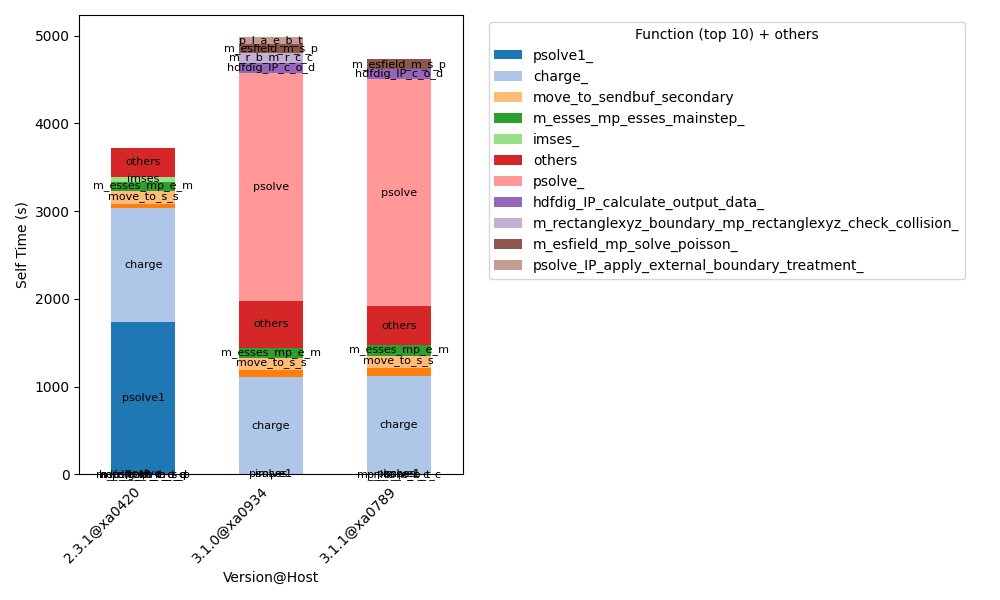
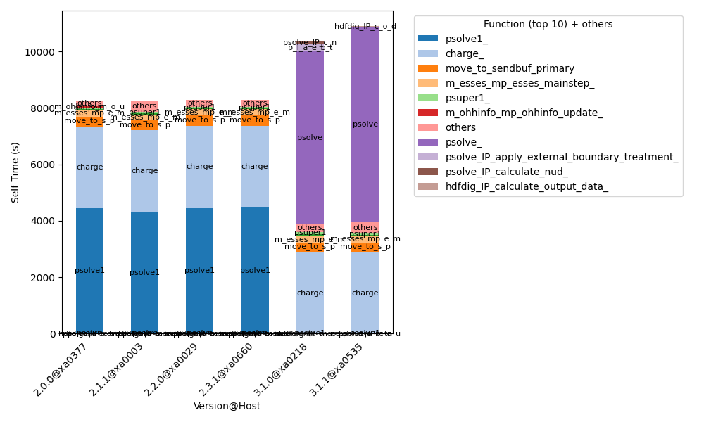
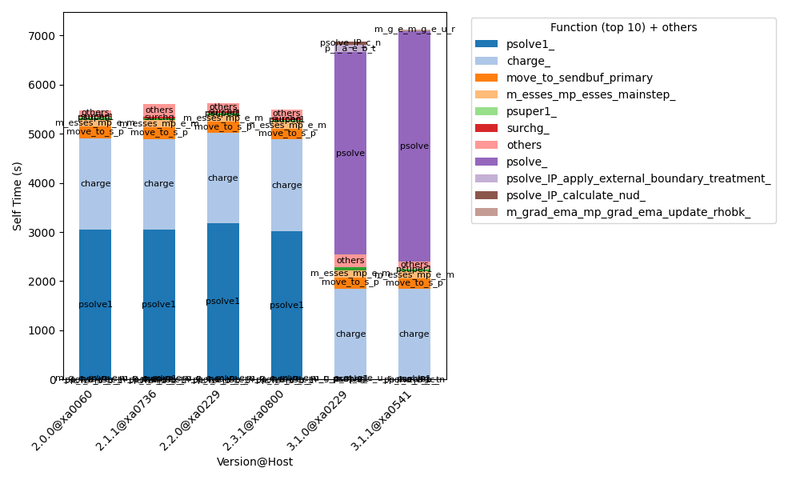

# Benchmark Harness Repository

This repository contains the complete benchmarking harness for the MPI-based simulation code. It has been split out from the main simulation repository to allow independent development, versioning, and CI integration.

---

## 🚀 Benchmark Results by Experiment

| Experiment       | Plot                                           |
|------------------|------------------------------------------------|
| exp_hole         |           |
| exp_probe        |        |
| exp_spacecraft   |  |

---

## 📂 Repository Structure

```
benchmark-harness/
├── experiments/        # Per-experiment parameter sets & job scripts
│   ├── exp_probe/      # e.g. probe deployment scenario
│   │   ├── params.yaml
│   │   └── job-camphor.sh      # Slurm/PBS submission script for camphor
│   ├── exp_hole/       # e.g. lunar cavity scenario
│   │   └── ...
│   └── exp_spacecraft/ # e.g. spacecraft flyby scenario
│       └── ...
├── results/            # Archived outputs (gprof, timings, metadata)
│   ├── exp_probe/
│   │   └── gprof_2.0.0_hpc1.txt
│   ├── exp_hole/
│   └── exp_spacecraft/
├── scripts/            # Utility scripts for archiving & plotting
│   ├── archive_gprof.sh      # Move gprof.txt → results/.../gprof_<ver>_<host>.txt
│   └── gprof_compare.py      # Build stacked bar charts across versions/hosts
└── Makefile            # Targets to run all experiments and generate comparisons
```

---

## 🛠 Prerequisites

* **Linux/macOS** with Bash, GNU Make
* **Python 3.7+** with:
  * `pandas`
  * `matplotlib`
  * `camptools`
  * `gprof2dot` (if you want to visualize call graphs separately)
* **MPI environment** and job scheduler (Slurm, PBS, etc.)
* **Simulation binary** (e.g. `mpiemses3D`) compiled with profiling option `-pg` available from `mymkdir --key emses` command

---

## 🚀 Quickstart

1. **Prepare your experiment**

   * Edit `experiments/exp_<name>/params.yaml` and `job.sh` to match your environment and parameter settings.
   * Ensure the simulation binary path in `job.sh` and `archive_gprof.sh` is correct.

2. **Run all benchmarks**

   ```bash
   make exp_all
   ```

   This will:

   * Create working directories via `mymkdir`
   * Generate input files via `preinp`
   * Submit jobs (`mysbatch job-camphor.sh`) for each experiment

3. **Archive profiling output**
   At the end of each `job.sh`, include:

   ```bash
   ../../scripts/archive_gprof.sh ./mpiemses3D gprof.txt
   ```

   This moves `gprof.txt` into `results/<experiment>/gprof_<version>_<hostname>.txt`.

4. **Generate comparison charts**

   ```bash
   make compare_probe
   make compare_hole
   make compare_spacecraft
   ```

   Or all at once:

   ```bash
   make compare_all
   ```

5. **View the plots**
   The PNG files `gprof_compare_<experiment>.png` will show stacked bar charts of top‑N functions + others across versions and hosts.

